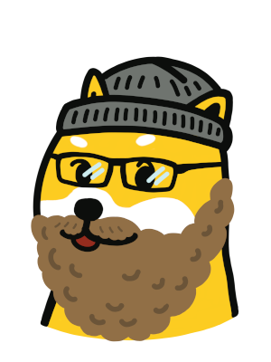

  
  <h2>Timothy Stebbing</h2>
  

 
  
Hi there 👋 I'm a hands-on technical leader, systems architect and engineer with more than twenty years commercial experience building scalable solutions with F/OSS tech-stacks. My specialty is the development of robust systems designed for reliability, security, scalability and maintainability. I am based in the mountains, east of Melbourne, Australia.

  <h4>Product Lead at Dogecoin Foundation</h4>  

I'm currently serving as a Director, Product Lead and Developer Advocate for the [Dogecoin Foundation](https://foundation.dogecoin.com), the not-for-profit organisation tasked with governance and advocacy for the [Dogecoin](https://dogecoin.com).  Started as a joke in 2008 to make light-hearted fun of Crypto, Dogecoin has grown into a global movement to create a viable digital currency, by the people, for the people. 

Fiercely decentralised and opensource, the Dogecoin Community rallies around our commitment to Do Only Good Everyday. Have a read of the [Dogecoin Manifesto](https://foundation.dogecoin.com/manifesto/) and take a look at our [Project Trailmap](https://foundation.dogecoin.com/trailmap/prologue/) to see what we're up to. 

